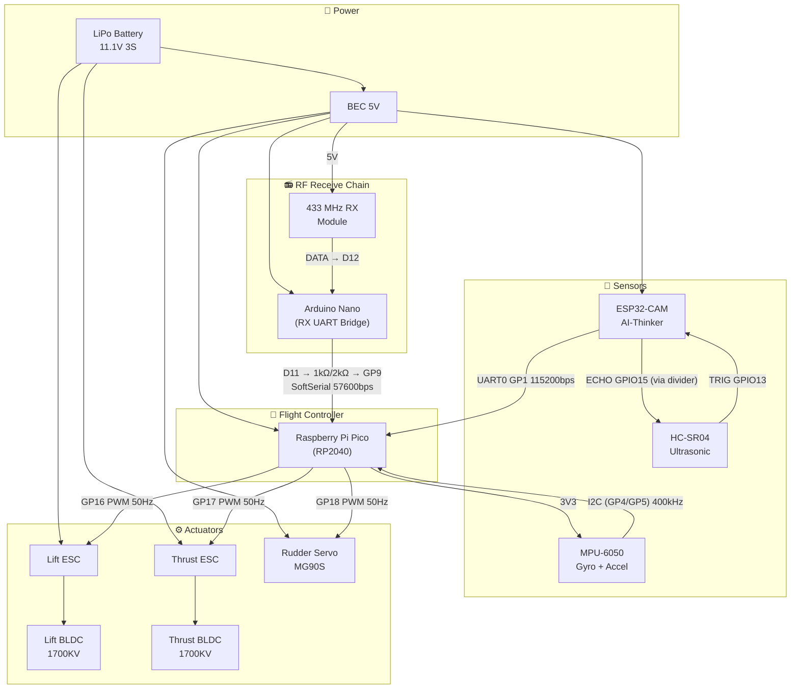
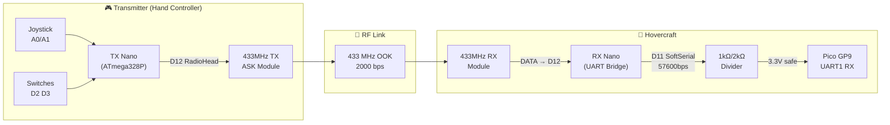
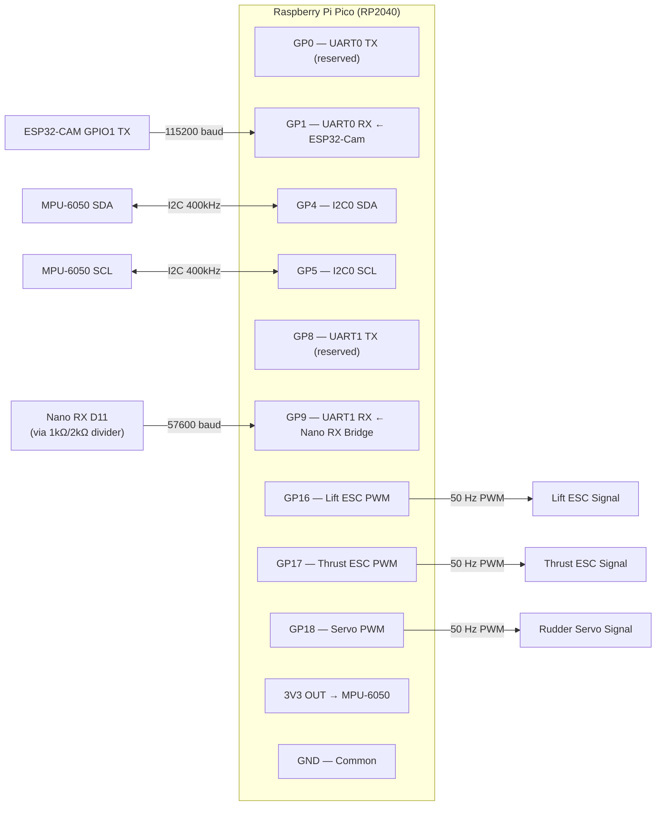
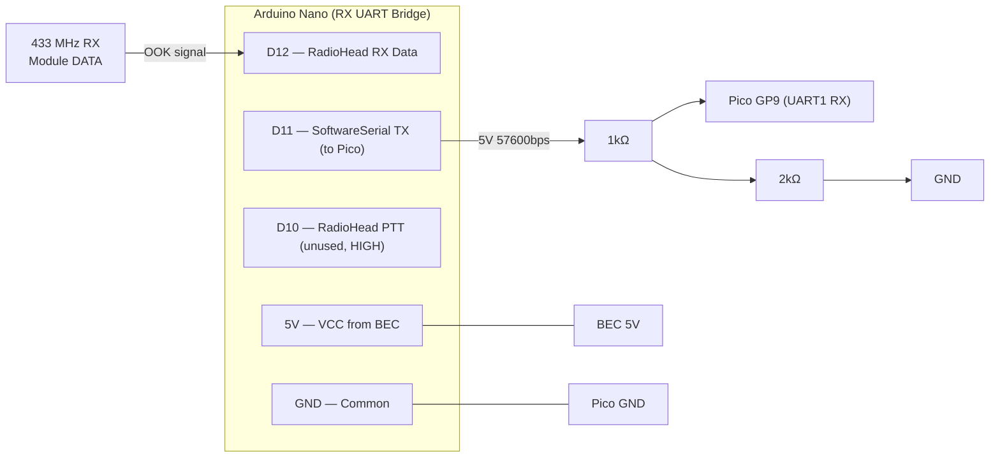
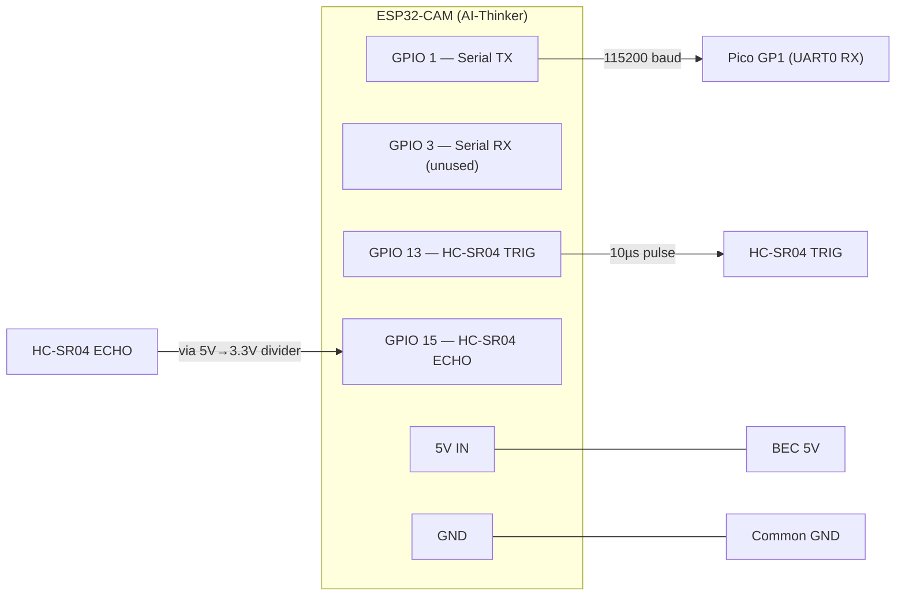
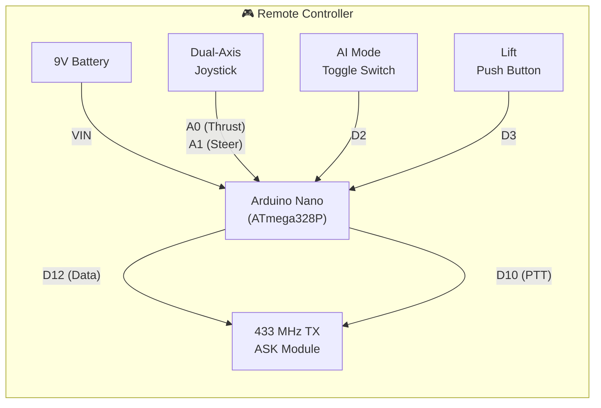
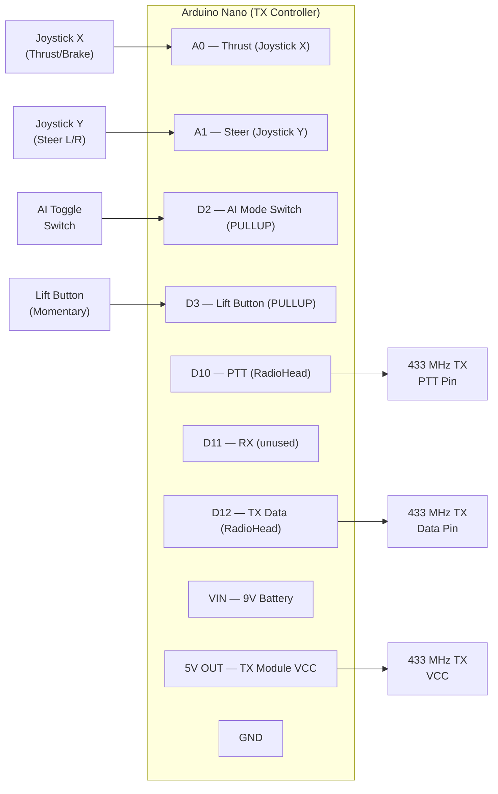
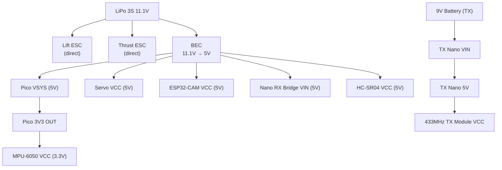

# Hovercraft v5.5 — Circuit Diagrams

## 1. Hovercraft (On-Board Electronics)

### System Overview



---

### Complete Signal Chain (RF → Control)



---

### Pico (RP2040) Pin Map



---

### Arduino Nano RX Bridge — Pin Map



---

### Detailed Wiring Table — Hovercraft

| Connection | From | Pin | To | Pin | Notes |
|-----------|------|-----|-----|-----|-------|
| **Lift ESC** | Pico | GP16 | ESC Signal | White | 50 Hz PWM, 1000–1350 µs |
| **Thrust ESC** | Pico | GP17 | ESC Signal | White | 50 Hz PWM, 1000–1900 µs |
| **Rudder Servo** | Pico | GP18 | Servo Signal | Orange | 50 Hz PWM, 500–2500 µs |
| **IMU SDA** | Pico | GP4 | MPU-6050 | SDA | I2C0 @ 400 kHz, 3.3V |
| **IMU SCL** | Pico | GP5 | MPU-6050 | SCL | I2C0 @ 400 kHz, 3.3V |
| **IMU Power** | Pico | 3V3 | MPU-6050 | VCC | 3.3V only |
| **IMU Ground** | Pico | GND | MPU-6050 | GND | Common ground |
| **ESP32 → Pico** | ESP32 | GPIO1 (TX) | Pico | GP1 (RX) | UART0, 115200 baud |
| **Ultrasonic TRIG** | ESP32 | GPIO13 | HC-SR04 | TRIG | 3.3V output |
| **Ultrasonic ECHO** | ESP32 | GPIO15 | HC-SR04 | ECHO | ⚠️ 5V→3.3V divider needed |
| **433MHz RX → Nano** | 433MHz RX | DATA | Nano RX | D12 | RadioHead RH_ASK rxPin |
| **Nano RX → Divider** | Nano RX | D11 | Resistor | 1kΩ | SoftSerial TX 5V |
| **Divider → Pico** | Resistor | 2kΩ | Pico | GP9 (RX) | UART1, 57600 baud, 3.3V |
| **Nano RX Power** | BEC | 5V | Nano RX | VIN/5V | 5V supply |
| **Nano RX Ground** | Nano RX | GND | Pico | GND | MUST share common ground |

### Nano RX → Pico Voltage Divider (5V → 3.3V)

```
Nano RX D11 (5V) ──[1kΩ]──┬── Pico GP9 (UART1 RX, 3.3V)
                            │
                          [2kΩ]
                            │
                           GND
```

> [!IMPORTANT]
> The Arduino Nano outputs **5V** logic on D11. The Pico GPIO is **3.3V only** — connecting them directly **will damage the Pico**. The 1kΩ/2kΩ resistor divider brings 5V down to ~3.33V (safe). The SoftwareSerial runs at **57600 bps**; the Pico UART1 must also be configured at 57600 bps.

---

### ESP32-CAM Wiring



> [!WARNING]
> GPIO 13 and 15 are shared with the SD card slot on the AI-Thinker ESP32-CAM. **Do NOT initialize the SD card** when using the ultrasonic sensor.

---

## 2. Remote Transmitter (Handheld Controller)

### Transmitter Overview



---

### Transmitter Pin Map



---

### Detailed Wiring Table — Transmitter

| Connection | From | Pin | To | Pin | Notes |
|-----------|------|-----|-----|-----|-------|
| **Joystick X** | Joystick | VRx | TX Nano | A0 | Thrust axis (fwd/back) |
| **Joystick Y** | Joystick | VRy | TX Nano | A1 | Steer axis (left/right) |
| **Joystick VCC** | TX Nano | 5V | Joystick | +5V | 5V reference |
| **Joystick GND** | TX Nano | GND | Joystick | GND | Common ground |
| **AI Toggle** | Switch | COM | TX Nano | D2 | `INPUT_PULLUP` — LOW = AI ON |
| **AI Toggle GND** | Switch | NC | TX Nano | GND | Switch to ground |
| **Lift Button** | Button | COM | TX Nano | D3 | `INPUT_PULLUP` — press to toggle |
| **Lift Button GND** | Button | NC | TX Nano | GND | Switch to ground |
| **433 TX Data** | TX Nano | D12 | TX Module | DATA | RadioHead RH_ASK @ 2000 bps |
| **433 TX PTT** | TX Nano | D10 | TX Module | PTT | Push-to-talk (RadioHead) |
| **433 TX VCC** | TX Nano | 5V | TX Module | VCC | 5V supply |
| **433 TX GND** | TX Nano | GND | TX Module | GND | Common ground |
| **433 TX Antenna** | — | — | TX Module | ANT | 17.3 cm wire (¼λ @ 433 MHz) |

---

### Joystick Axis Mapping

```
                   FORWARD (thrust > 0)
                        ↑
                   ┌────┼────┐
                   │    │    │
         LEFT ─────┼────●────┼───── RIGHT
        (steer-)   │    │    │   (steer+)
                   └────┼────┘
                        ↓
                   BACKWARD (BRK = 1)
```

| Joystick Position | Nano Value | Pico Variable | Effect |
|-------------------|-----------|---------------|--------|
| Forward | `rawX > 552` | `joy_y = 0.0–1.0` | Forward thrust |
| Backward | `rawX < 472` | `brake_mode = True` | Turn-around mode |
| Left | `rawY < 472` | `joy_x < 0` | Steer left |
| Right | `rawY > 552` | `joy_x > 0` | Steer right |
| Center | `472–552` | `joy_x/y ≈ 0` | Neutral (deadzone) |

---

### Serial Packet Format (TX Nano → 433MHz → RX Nano → Pico)

```
RF Packet (6 bytes, RadioHead RH_ASK):
┌────────┬───────┬──────┬───────┬──────────┬──────────┐
│ thrust │ steer │ lift │  AI   │  brake   │ checksum │
│ 0–255  │ ±100  │ 0/1  │  0/1  │   0/1    │   XOR    │
└────────┴───────┴──────┴───────┴──────────┴──────────┘
  1 B      1 B    1 B    1 B      1 B         1 B

UART Frame (8 bytes, RX Nano → Pico at 57600 bps):
┌──────┬──────┬────────┬───────┬──────┬───────┬──────────┬──────────┐
│ 0xAA │ 0x55 │ thrust │ steer │ lift │  AI   │  brake   │ checksum │
│ sync │ sync │ 0–255  │ ±100  │ 0/1  │  0/1  │   0/1    │   XOR    │
└──────┴──────┴────────┴───────┴──────┴───────┴──────────┴──────────┘
  1 B    1 B    1 B      1 B    1 B    1 B      1 B         1 B

Pico UART1: baudrate=57600, GP9 RX, 8N1
Pico struct.unpack: '<BbBBBB' (6 bytes after stripping 2 sync bytes)
```

---

## 3. Power Distribution



> [!TIP]
> Use a dedicated BEC (not the ESC's built-in BEC) for clean 5V. ESC BECs have switching noise that affects the MPU-6050 gyro readings.

---

## 4. MLP Neural Network Architecture

```
Input Layer (7 nodes)          Hidden Layer (8 nodes)      Output Layer (4 nodes)
─────────────────────          ──────────────────────      ─────────────────────
 ax  (accel X, g)    ──┐
 ay  (accel Y, g)    ──┤       ┌──────────────────┐        lift_trim_us  (±50 µs)
 az  (accel Z, g)    ──┼──────►│  8 × tanh nodes  ├───────►thrust_trim_us(±50 µs)
 joy_x (steer ±1)   ──┤       │  (LUT approx)    │        servo_trim_us (±312 µs)
 joy_y (thrust ±1)  ──┤       └──────────────────┘        alert / conf  (0–1)
 obstacle (0/1)      ──┤
 yaw_rate (°/s /250) ──┘

Weights: int8 quantized (-127..127), dequantized × (1/127)
Activations: 256-entry LUT tanh / sigmoid (no math.exp)
Inference: < 10 ms on RP2040 @ 125 MHz (100 Hz budget)
```

---

## 5. On-Board Dual-Core Architecture

```
┌──────────────────────────────────────────────────────────┐
│                    Raspberry Pi Pico (RP2040)            │
│                                                          │
│  ┌─ Core 0 (I/O) ─────────────────┐                     │
│  │  UART0 (GP1) ← ESP32-Cam       │                     │
│  │   Obstacle veto + Geometry 0xD4│                     │
│  │  UART1 (GP9) ← Nano RX Bridge  │                     │
│  │   57600bps framed packet parser │                     │
│  │            ↓                   │                     │
│  │   Shared State (thread-safe)   │                     │
│  │   joy_x/y, lift, ai, brake,    │                     │
│  │   obstacle_dir, cam_aspect,    │                     │
│  │   cam_height, ultra_dist       │                     │
│  └────────────────────────────────┘                     │
│                     ↓ _lock (mutex)                      │
│  ┌─ Core 1 (Control 100Hz) ───────────────────────┐     │
│  │  MPU-6050 I2C (GP4/GP5)                        │     │
│  │  MLP Inference (mlp_logic.py / weights.py)     │     │
│  │  hover_control.compute_targets()               │     │
│  │  Heading Memory + Pilot Overrule               │     │
│  │  Human Detection + Obstacle Veto               │     │
│  │            ↓                                   │     │
│  │   GP16 Lift ESC    GP17 Thrust ESC   GP18 Servo│     │
│  └────────────────────────────────────────────────┘     │
└──────────────────────────────────────────────────────────┘
```
